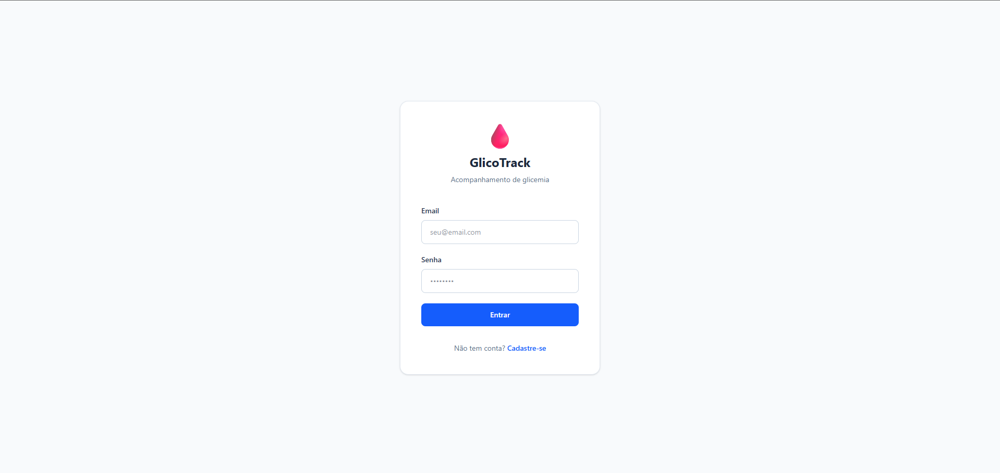
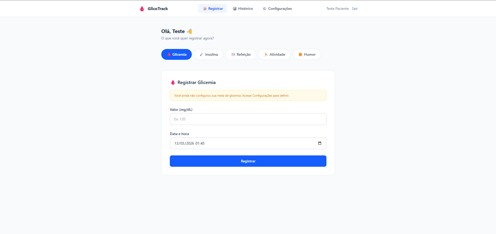
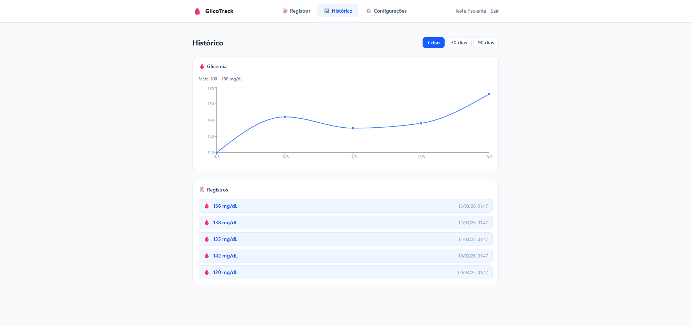
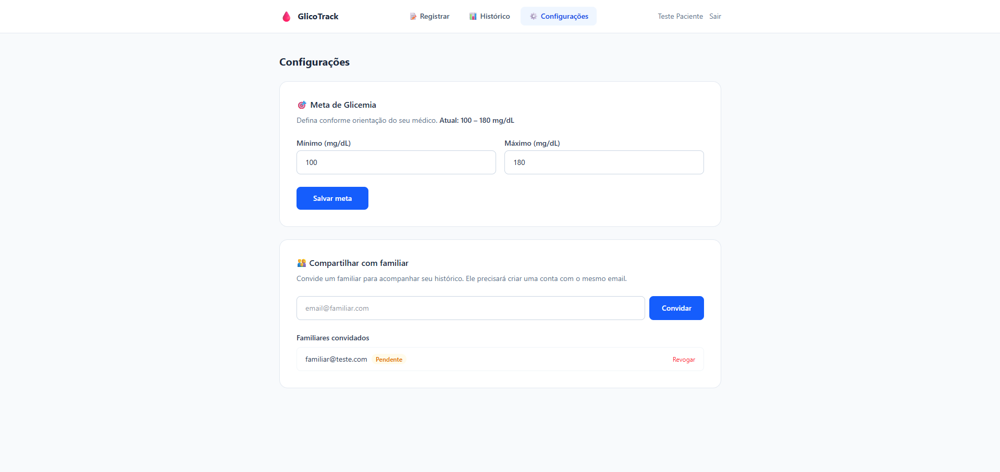

# GlicoTrack

App web responsivo para acompanhamento da saúde de pessoas com diabetes. Permite o registro diário de glicemia, insulina, refeições, atividades físicas e humor, com histórico e gráficos para acompanhamento familiar.

## Evidências

> Adicione aqui capturas de tela das telas principais do app.

| Tela | Descrição |
|---|---|
|  | Tela de login |
|  | Painel principal com registros do dia |
|  | Gráfico de glicemia ao longo do tempo |
|  | Meta de glicemia e convite de familiares |

---

## Funcionalidades

- Registro de glicemia com indicação visual (dentro/fora da meta)
- Registro de dose de insulina
- Registro de refeições, atividade física e humor
- Meta de glicemia configurável por faixa (mínimo e máximo)
- Histórico com gráficos (Recharts)
- Acesso de familiares em modo somente leitura via convite

## Stack

| Camada | Tecnologia |
|---|---|
| Frontend | React 19 + Vite |
| Estilização | Tailwind CSS |
| Gráficos | Recharts |
| Backend + Banco | Supabase |

## Como rodar localmente

**Pré-requisitos:** Node.js 18+

```bash
# 1. Instalar dependências
npm install

# 2. Configurar variáveis de ambiente
cp .env.example .env
# Edite o .env com suas credenciais do Supabase

# 3. Iniciar o servidor de desenvolvimento
npm run dev
```

## Variáveis de ambiente

Crie um arquivo `.env` na raiz do projeto com base no `.env.example`:

```env
VITE_SUPABASE_URL=sua_url_do_projeto_no_supabase
VITE_SUPABASE_ANON_KEY=sua_chave_anonima_do_supabase
```

As credenciais estão disponíveis em **Supabase > Project Settings > API**.

## Scripts disponíveis

```bash
npm run dev      # Servidor de desenvolvimento
npm run build    # Build de produção
npm run preview  # Pré-visualização do build
npm run lint     # Verificação de lint
```

## Estrutura do projeto

```
src/
├── components/
│   ├── configuracoes/   # Formulários de meta e convite familiar
│   ├── historico/       # Gráfico e lista de registros
│   ├── layout/          # Navbar e layout geral
│   └── registros/       # Formulários de glicemia, insulina, refeição, etc.
├── contexts/            # Contexto de autenticação
├── lib/                 # Cliente Supabase
└── pages/               # Login, Cadastro, Dashboard, Histórico, Configurações
```
